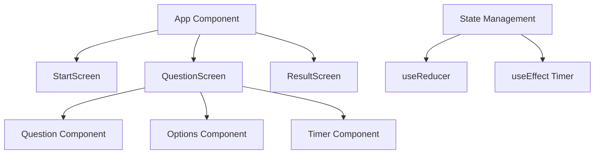

# 📝 React Quiz App  

A React-based quiz application built to practice **React hooks**, particularly `useReducer`, while working with dynamic JSON-based quiz data.  

🔗 **[Live Demo](https://qasim-mehar.github.io/React-Quiz-ReactJs-practice-project/)**  

  
  
  


---

## 🎯 Project Overview  

**React Quiz** is an interactive quiz app where users can:  

- 📖 Attempt multiple-choice questions served from a hosted JSON file.  
- ⏱️ Track time left while taking the quiz.  
- ✅ Receive instant feedback on their answers.  
- 📊 View their final score at the end of the quiz.  
- 🔄 Restart the quiz anytime.  

---

## 🌐 Preview  

<p align="center">  
    
    
    
</p>  

---

## 🚀 Key Learning Outcomes  

This project demonstrates:  

### 🎣 `useReducer` for State Management  
- Centralized state handling for quiz flow.  
- Clean logic for transitions: start → answer → next → finish → restart.  
- Replaces multiple `useState` hooks with a single reducer function.  

### 🔄 React Hooks Mastery  
- **`useReducer`**: Manages quiz states, score, and timer.  
- **`useEffect`**: Timer countdown and side effects.  
- **`useState`**: Input and UI toggles where needed.  

---

## 🛠️ Technical Implementation Highlights  

### 📂 JSON  Endpoints as Data Source  
- A separate `db.json` file is deployed and used as an API endpoint.  
- Quiz questions are fetched dynamically from this endpoint.  
- Keeps the quiz flexible: data can be updated without touching React code.  
 

### ⏱️ Timer Functionality  
- Countdown logic inside `useEffect`.  
- Auto submission when time ends.  

### 🎯 Answer Validation  
- User answer compared with correct option.  
- Score updated in reducer state.  

---

## 📊 Project Architecture  



---

## 🎨 Component Structure  

- **StartScreen**: Intro screen with "Start Quiz" button.  
- **QuestionScreen**: Displays question, options, timer, and next button.  
- **ResultScreen**: Shows score and restart option.  
- **Timer**: Handles countdown logic.  
- **Reducer**: Centralizes quiz state (score, index, time).  

---

## 💡 Advanced Patterns Demonstrated  

- **Reducer Pattern**: Clean state transitions with actions (`start`, `answer`, `next`, `finish`, `restart`).  
- **Controlled Components**: Handling user answers.  
- **Side Effects Cleanup**: Clearing timer intervals in `useEffect`.  
- **Data Decoupling**: Using external JSON as a question bank.  

---

## 🎪 Interactive Features  

| Feature | Implementation | User Benefit |  
|---------|----------------|--------------|  
| 📝 **Dynamic Questions** | JSON file as endpoint | Easy to update quiz without touching code |  
| ⏱️ **Countdown Timer** | `useEffect` interval logic | Adds challenge and urgency |  
| ✅ **Instant Feedback** | Answer check inside reducer | Know immediately if correct |  
| 📊 **Final Results** | Reducer score aggregation | Clear performance summary |  
| 🔄 **Restart Quiz** | Reducer `restart` action | Take quiz again instantly |  

---

## 🚀 Getting Started  

1. **Clone the repository**  
   ```bash
   git clone https://github.com/qasim-mehar/React-Quiz-React-practice-project.git
   ```  

2. **Install dependencies**  
   ```bash
   npm install
   ```  

3. **Start development server**  
   ```bash
   npm start
   ```  

4. Open in browser at `http://localhost:3000` 🎉  

---

## 🎓 Skills Demonstrated  

### ✅ React Fundamentals  
- Component composition and props  
- State and event handling  

### ✅ Advanced React Patterns  
- Reducer-driven state transitions  
- Effect cleanup and timer logic  

### ✅ JavaScript Proficiency  
- ES6+ features: destructuring, spread, array methods  
- Async data fetching with `fetch`  

### ✅ Data Handling  
- Dynamic JSON endpoints  
- Error handling for fetch failures  

---

*Built with ❤️ by Qasim Ali as a learning project to master `useReducer` and structured state management in React*  
